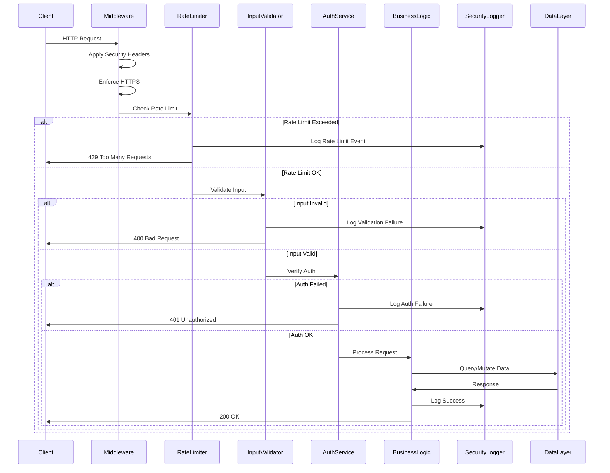

# Design Document: Comprehensive Security Enhancements

## Overview

This design document specifies the implementation of enterprise-grade security enhancements for cheapfollower.shop. The system will implement defense-in-depth security across all layers: API rate limiting, input validation, authentication hardening, payment security, data encryption, XSS/CSRF protection, secure session management, audit logging, and dependency scanning.

### Goals

- **Prevent Attack Vectors**: Block SQL injection, XSS, CSRF, enumeration attacks, and brute force attempts
- **Protect Sensitive Data**: Encrypt PII and payment information at rest, secure data in transit
- **Enable Security Monitoring**: Comprehensive audit logging for forensic analysis and compliance
- **Maintain Usability**: Security controls should not degrade legitimate user experience
- **Zero Trust Architecture**: Validate and sanitize all inputs, verify all requests, authenticate all actions

### Current Security Baseline

The system currently has:
- Cryptographically secure order IDs (8-character alphanumeric, unpredictable)
- HMAC-based admin session tokens with 256-bit entropy
- Rate limiting on admin login (5 attempts per 15 minutes)
- In-memory rate limiter infrastructure (`src/lib/rate-limit.ts`)
- Basic input sanitization in order processing
- Supabase integration for database operations (parameterized queries by default)
- HTTPS in production with secure cookie flags

### Security Enhancements Scope

This feature adds:
1. **Enhanced Rate Limiting**: Expand to all public APIs, order creation, payment endpoints, order tracking
2. **Comprehensive Input Validation**: Strict validation layer for all user inputs with SQL/XSS detection
3. **CSRF Protection**: Token-based CSRF protection for all state-changing operations
4. **Security Headers**: CSP, HSTS, X-Frame-Options, and other protective headers
5. **Session Security**: Enhanced session management with IP binding and concurrent session detection
6. **Payment Security**: Webhook signature verification, amount validation, duplicate detection
7. **Data Encryption**: AES-256 encryption for emails and payment metadata at rest
8. **Audit Logging**: Immutable security event logs with 90-day retention
9. **Admin Hardening**: Password complexity, account lockout, IP change alerts
10. **Dependency Scanning**: Automated vulnerability scanning in CI/CD pipeline
11. **Order Tracking Security**: Anti-enumeration, rate limiting, data masking
12. **Parser Security**: Safe JSON/email parsing with size and depth limits

## Architecture

### Security Layers

```
┌─────────────────────────────────────────────────────────────┐
│                     Client (Browser)                         │
│              - CSP Headers                                   │
│              - XSS Protection                                │
│              - HTTPS Enforcement                             │
└──────────────────────────┬──────────────────────────────────┘
                           │
                           ↓
┌─────────────────────────────────────────────────────────────┐
│                  Next.js Middleware Layer                    │
│  - HTTPS Redirect                                            │
│  - Security Headers (CSP, HSTS, X-Frame-Options)            │
│  - Admin Route Protection                                    │
│  - CSRF Token Validation                                     │
└──────────────────────────┬──────────────────────────────────┘
                           │
                           ↓
┌─────────────────────────────────────────────────────────────┐
│                   API Route Handlers                         │
│  ┌─────────────────────────────────────────────────────┐   │
│  │  Security Middleware Chain (executed in order)      │   │
│  │  1. Rate Limiter         → 429 if exceeded          │   │
│  │  2. Authentication       → 401 if invalid           │   │
│  │  3. Input Validator      → 400 if malformed         │   │
│  │  4. Business Logic       → Process request          │   │
│  │  5. Security Logger      → Audit trail              │   │
│  └─────────────────────────────────────────────────────┘   │
└──────────────────────────┬──────────────────────────────────┘
                           │
         ┌─────────────────┼─────────────────┐
         │                 │                 │
         ↓                 ↓                 ↓
┌────────────────┐  ┌────────────┐  ┌────────────────┐
│  Order Service │  │  Payment   │  │  Auth Service  │
│                │  │  Service   │  │                │
│  - Provider    │  │  - Webhook │  │  - Session Mgr │
│    API calls   │  │    verify  │  │  - JWT tokens  │
│  - Status sync │  │  - Amount  │  │  - Password    │
│                │  │    check   │  │    validation  │
└────────┬───────┘  └─────┬──────┘  └────────┬───────┘
         │                │                   │
         └────────────────┼───────────────────┘
                          │
                          ↓
         ┌────────────────────────────────────┐
         │       Data Layer                   │
         │  ┌──────────────────────────────┐ │
         │  │  Supabase (Production)       │ │
         │  │  - Encrypted connections     │ │
         │  │  - Row-level security        │ │
         │  │  - Encrypted at rest         │ │
         │  └──────────────────────────────┘ │
         │  ┌──────────────────────────────┐ │
         │  │  File System (Development)   │ │
         │  │  - admin-store.json          │ │
         │  │  - orders.json               │ │
         │  │  - Encrypted sensitive fields│ │
         │  └──────────────────────────────┘ │
         └────────────────────────────────────┘
```

### Security Component Interactions



### Deployment Architecture

**Development Environment:**
- File-based storage (data/*.json)
- HTTP allowed for local testing
- Detailed error messages
- No encryption for emails (performance)

**Production Environment (Vercel):**
- Supabase for persistent storage
- HTTPS enforced with HSTS
- Generic error messages
- Full encryption enabled
- Environment variables in Vercel dashboard
- Automatic HTTPS certificate management

## Components and Interfaces

### 1. Enhanced Rate Limiter

**Location:** `src/lib/rate-limit.ts` (extend existing)

**Interface:**
```typescript
// Existing interface - extend with new configurations
export interface RateLimitConfig {
  windowMs: number;      // Time window in milliseconds
  maxRequests: number;   // Max requests per window
  blockDuration?: number; // Optional: how long to block after violations
}

// New: Track violations for IP blocking
export interface ViolationTracker {
  count: number;
  firstViolation: number;
  blockedUntil: number | null;
}

// Enhanced rate limit checking with violation tracking
export function isRateLimited(
  identifier: string, 
  config: RateLimitConfig, 
  trackViolations?: boolean
): boolean;

// Check if IP is currently blocked
export function isBlocked(identifier: string): boolean;

// Block an IP for specified duration
export function blockIdentifier(identifier: string, durationMs: number): void;

// Get remaining requests in current window
export function getRemainingRequests(identifier: string, config: RateLimitConfig): number;

// New preset configurations
export const rateLimits = {
  adminLogin: { windowMs: 15 * 60 * 1000, maxRequests: 5 },
  orderCreation: { windowMs: 60 * 60 * 1000, maxRequests: 10 },  // 10 per hour
  paymentVerification: { windowMs: 60 * 1000, maxRequests: 5 },  // 5 per minute
  publicAPI: { windowMs: 60 * 1000, maxRequests: 100 },  // 100 per minute
  orderTracking: { windowMs: 60 * 60 * 1000, maxRequests: 20 },  // 20 per hour
  promoCodeValidation: { windowMs: 60 * 1000, maxRequests: 5 },  // 5 per minute
};
```

**Responsibilities:**
- Track request counts per identifier (IP or user ID) per time window
- Enforce configurable rate limits per endpoint type
- Track repeated violations for automatic IP blocking
- Block IPs after 10 violations in 1 hour for 24 hours
- Provide violation tracking for security logger
- Clean up expired entries periodically

**Data Storage:**
```typescript
// In-memory storage (existing pattern)
const rateLimitMap = new Map<string, RateLimitEntry>();
const violationMap = new Map<string, ViolationTracker>();
const blockList = new Map<string, number>(); // identifier -> blockedUntil timestamp
```

### 2. Input Validator

**Location:** `src/lib/input-validator.ts` (new file)

**Interface:**
```typescript
export interface ValidationRule {
  type: 'string' | 'email' | 'url' | 'orderId' | 'quantity' | 'phone' | 'cashtag';
  required?: boolean;
  minLength?: number;
  maxLength?: number;
  pattern?: RegExp;
  allowedChars?: string;
  min?: number;  // For numeric types
  max?: number;  // For numeric types
}

export interface ValidationResult {
  valid: boolean;
  sanitized?: string | number;
  errors: string[];
}

// Validate and sanitize a single field
export function validateField(
  value: unknown, 
  rule: ValidationRule
): ValidationResult;

// Validate an entire object against a schema
export function validateObject<T>(
  data: unknown, 
  schema: Record<string, ValidationRule>
): { valid: boolean; data?: T; errors: Record<string, string[]> };

// Sanitization utilities
export function sanitizeString(input: string): string;
export function escapeHtml(input: string): string;
export function stripSqlKeywords(input: string): string;
export function validateEmail(email: string): boolean;
export function validateOrderId(orderId: string): boolean;
export function validateUrl(url: string): boolean;
export function sanitizeQuantity(qty: unknown): number;
```

**Validation Rules:**

| Field Type | Rules |
|------------|-------|
| **string** | Remove null bytes, control characters, non-printable ASCII; escape HTML entities; reject SQL keywords |
| **email** | RFC 5322 compliant regex; max 254 chars; lowercase normalization |
| **orderId** | Format: `ORD-[8 alphanumeric]`; case-insensitive match |
| **url** | Must start with `http://` or `https://`; max 2048 chars; reject javascript: protocol |
| **quantity** | Positive integer; 1 ≤ qty ≤ 1,000,000 |
| **cashtag** | Format: `$[alphanumeric 1-20 chars]`; case-insensitive |
| **phone** | Digits, spaces, +, -, (, ) only; 10-15 digits |

**SQL Injection Prevention:**
```typescript
const SQL_KEYWORDS = [
  'SELECT', 'DROP', 'DELETE', 'INSERT', 'UPDATE', 'UNION', 
  'EXEC', 'EXECUTE', 'SCRIPT', '--', '/*', '*/', ';--', 
  'xp_', 'sp_'
];

// Reject input containing SQL patterns (case-insensitive)
function containsSqlInjection(input: string): boolean {
  const upper = input.toUpperCase();
  return SQL_KEYWORDS.some(keyword => upper.includes(keyword));
}
```

**XSS Prevention:**
```typescript
// Escape HTML entities
function escapeHtml(str: string): string {
  return str
    .replace(/&/g, '&amp;')
    .replace(/</g, '&lt;')
    .replace(/>/g, '&gt;')
    .replace(/"/g, '&quot;')
    .replace(/'/g, '&#x27;')
    .replace(/\//g, '&#x2F;');
}

// Detect script tags and event handlers
const XSS_PATTERNS = [
  /<script[^>]*>[\s\S]*?<\/script>/gi,
  /on\w+\s*=\s*["']?[^"']*["']?/gi,  // event handlers
  /javascript:/gi,
  /<iframe/gi,
  /<object/gi,
  /<embed/gi
];
```

### 3. CSRF Manager

**Location:** `src/lib/csrf.ts` (new file)

**Interface:**
```typescript
export interface CsrfToken {
  token: string;
  sessionId: string;
  createdAt: number;
  expiresAt: number;
}

// Generate a new CSRF token for a session
export function generateCsrfToken(sessionId: string): string;

// Verify CSRF token against session
export function verifyCsrfToken(token: string, sessionId: string): boolean;

// Clean up expired tokens
export function cleanupExpiredTokens(): void;

// Get CSRF token from request headers
export function getCsrfTokenFromRequest(req: Request): string | null;
```

**Implementation:**
```typescript
const CSRF_TOKEN_BYTES = 32;
const CSRF_EXPIRY_MS = 60 * 60 * 1000; // 1 hour

const csrfStore = new Map<string, CsrfToken>();

export function generateCsrfToken(sessionId: string): string {
  // Generate cryptographically random token
  const bytes = crypto.getRandomValues(new Uint8Array(CSRF_TOKEN_BYTES));
  const token = Array.from(bytes, b => b.toString(16).padStart(2, '0')).join('');
  
  const csrfToken: CsrfToken = {
    token,
    sessionId,
    createdAt: Date.now(),
    expiresAt: Date.now() + CSRF_EXPIRY_MS,
  };
  
  csrfStore.set(token, csrfToken);
  return token;
}

export function verifyCsrfToken(token: string, sessionId: string): boolean {
  const csrf = csrfStore.get(token);
  if (!csrf) return false;
  if (csrf.expiresAt < Date.now()) {
    csrfStore.delete(token);
    return false;
  }
  if (csrf.sessionId !== sessionId) return false;
  return true;
}
```

**Middleware Integration:**
```typescript
// In Next.js middleware or API route
export function requireCsrf(req: Request, sessionId: string): Response | null {
  if (['POST', 'PUT', 'DELETE', 'PATCH'].includes(req.method)) {
    const token = req.headers.get('X-CSRF-Token');
    if (!token || !verifyCsrfToken(token, sessionId)) {
      return new Response('CSRF token validation failed', { status: 403 });
    }
  }
  return null; // Allow request
}
```

### 4. Security Logger

**Location:** `src/lib/security-logger.ts` (new file)

**Interface:**
```typescript
export type SecurityEventType = 
  | 'auth.login.success'
  | 'auth.login.failure'
  | 'auth.logout'
  | 'auth.session.invalid'
  | 'rate_limit.exceeded'
  | 'rate_limit.blocked'
  | 'input.validation.failure'
  | 'payment.webhook.received'
  | 'payment.webhook.invalid'
  | 'payment.amount.mismatch'
  | 'admin.settings.changed'
  | 'admin.service.modified'
  | 'order.status.changed'
  | 'order.enumeration.detected'
  | 'csrf.validation.failure'
  | 'sql_injection.attempt'
  | 'xss.attempt';

export interface SecurityEvent {
  id: string;
  timestamp: string;
  type: SecurityEventType;
  actor: string;  // user ID, IP, or 'system'
  target?: string;  // order ID, setting name, etc.
  details: Record<string, unknown>;
  ipAddress?: string;
  userAgent?: string;
  correlationId?: string;
}

// Log a security event
export function logSecurityEvent(event: Omit<SecurityEvent, 'id' | 'timestamp'>): void;

// Get recent security events (for admin dashboard)
export function getRecentEvents(limit?: number): Promise<SecurityEvent[]>;

// Get events by type
export function getEventsByType(type: SecurityEventType, limit?: number): Promise<SecurityEvent[]>;

// Get events for a specific actor
export function getEventsByActor(actor: string, limit?: number): Promise<SecurityEvent[]>;
```

**Storage Strategy:**
```typescript
// Store in admin-store.json for now, migrate to Supabase table later
export type SecurityLog = {
  events: SecurityEvent[];
  retentionDays: number;
};

// In admin-store.ts, add to AdminStore type:
export type AdminStore = {
  // ... existing fields
  securityLog?: SecurityLog;
};
```

**PII Protection:**
```typescript
// Hash email addresses in logs
function hashPii(value: string): string {
  const encoder = new TextEncoder();
  const data = encoder.encode(value);
  return crypto.subtle.digest('SHA-256', data)
    .then(hash => Array.from(new Uint8Array(hash), b => b.toString(16).padStart(2, '0')).join(''));
}

// Mask IP addresses (keep first 2 octets)
function maskIp(ip: string): string {
  const parts = ip.split('.');
  if (parts.length === 4) {
    return `${parts[0]}.${parts[1]}.*.*`;
  }
  return ip; // IPv6 or invalid - return as-is
}
```

### 5. Session Manager (Enhanced)

**Location:** `src/lib/admin-auth.ts` (extend existing)

**Enhanced Session Token Structure:**
```typescript
// Current: "ok.{expiry}.{hmac}"
// Enhanced: "ok.{expiry}.{ip}.{hmac}"

export interface SessionMetadata {
  createdAt: number;
  lastActivity: number;
  ipAddress: string;
  userAgent: string;
}

const sessionStore = new Map<string, SessionMetadata>();

export async function signAdminSession(ipAddress: string, userAgent: string): Promise<string> {
  const exp = Date.now() + (2 * 60 * 60 * 1000); // 2 hours for admin
  const sessionId = crypto.randomUUID();
  const payload = `ok.${exp}.${sessionId}`;
  const signature = await hmacHex(payload);
  const token = `${payload}.${signature}`;
  
  sessionStore.set(sessionId, {
    createdAt: Date.now(),
    lastActivity: Date.now(),
    ipAddress,
    userAgent,
  });
  
  return token;
}

export async function isValidAdminSession(
  token: string | undefined | null,
  ipAddress: string
): Promise<boolean> {
  if (!token) return false;
  
  const parts = token.split(".");
  if (parts.length !== 4) return false;
  
  const [ok, expRaw, sessionId, sig] = parts;
  if (ok !== "ok") return false;
  
  const exp = Number(expRaw);
  if (!Number.isFinite(exp) || exp < Date.now()) return false;
  
  // Verify HMAC signature
  const payload = `${ok}.${expRaw}.${sessionId}`;
  const expected = await hmacHex(payload);
  if (!safeEqual(sig, expected)) return false;
  
  // Check session metadata
  const metadata = sessionStore.get(sessionId);
  if (!metadata) return false;
  
  // Check for suspicious IP change
  if (metadata.ipAddress !== ipAddress) {
    logSecurityEvent({
      type: 'auth.session.invalid',
      actor: sessionId,
      details: { reason: 'IP address mismatch', expected: metadata.ipAddress, actual: ipAddress }
    });
    return false;
  }
  
  // Update last activity
  metadata.lastActivity = Date.now();
  
  return true;
}

// Session timeout check
export function cleanupExpiredSessions(): void {
  const now = Date.now();
  const ADMIN_TIMEOUT = 2 * 60 * 60 * 1000; // 2 hours
  
  for (const [sessionId, metadata] of sessionStore.entries()) {
    if (now - metadata.lastActivity > ADMIN_TIMEOUT) {
      sessionStore.delete(sessionId);
    }
  }
}

// Run cleanup every 15 minutes
setInterval(cleanupExpiredSessions, 15 * 60 * 1000);
```

### 6. Payment Security Module

**Location:** `src/lib/payment-security.ts` (new file)

**Interface:**
```typescript
export interface PaymentVerification {
  valid: boolean;
  errors: string[];
  warnings: string[];
}

// Verify webhook signature (provider-specific)
export function verifyWebhookSignature(
  provider: 'nowpayments' | 'paypal' | 'cashapp',
  payload: string,
  signature: string | null
): boolean;

// Verify payment amount matches order
export function verifyPaymentAmount(
  orderAmount: number,
  paidAmount: number,
  tolerance?: number  // Default 0.01
): PaymentVerification;

// Check for duplicate payment notification
export function isDuplicatePayment(
  gatewayId: string,
  transactionId?: string
): Promise<boolean>;

// Validate CashApp sender (blocklist check)
export function isCashtagBlocked(cashtag: string): Promise<boolean>;

// Add cashtag to blocklist
export function blockCashtag(cashtag: string, reason: string): Promise<void>;
```

**Webhook Signature Verification:**
```typescript
// NowPayments IPN signature verification (already exists)
export function verifyNowpaymentsSignature(rawBody: string, signature: string | null): boolean {
  const secret = process.env.NOWPAYMENTS_IPN_SECRET;
  if (!secret || !signature) return false;
  
  const hmac = crypto.createHmac('sha512', secret);
  hmac.update(rawBody);
  const expected = hmac.digest('hex');
  
  return safeEqual(signature, expected);
}

// PayPal webhook signature verification
export function verifyPaypalSignature(
  webhookId: string,
  event: unknown,
  headers: Record<string, string>
): Promise<boolean> {
  // Use PayPal SDK verification
  // https://developer.paypal.com/docs/api/webhooks/v1/#verify-webhook-signature
  // Implementation details depend on PayPal SDK
  return Promise.resolve(true); // Placeholder
}
```

**Amount Verification:**
```typescript
export function verifyPaymentAmount(
  orderAmount: number,
  paidAmount: number,
  tolerance = 0.01
): PaymentVerification {
  const diff = Math.abs(orderAmount - paidAmount);
  
  if (diff <= tolerance) {
    return { valid: true, errors: [], warnings: [] };
  }
  
  if (paidAmount < orderAmount) {
    return {
      valid: false,
      errors: [`Payment insufficient: expected $${orderAmount.toFixed(2)}, received $${paidAmount.toFixed(2)}`],
      warnings: []
    };
  }
  
  // Overpayment - valid but warn
  return {
    valid: true,
    errors: [],
    warnings: [`Payment exceeds order amount: expected $${orderAmount.toFixed(2)}, received $${paidAmount.toFixed(2)}`]
  };
}
```

### 7. Data Encryption Module

**Location:** `src/lib/encryption.ts` (new file)

**Interface:**
```typescript
// Encrypt a string value
export function encrypt(plaintext: string): string;

// Decrypt a string value
export function decrypt(ciphertext: string): string;

// Encrypt with integrity check (HMAC)
export function encryptWithHmac(plaintext: string): string;

// Decrypt and verify integrity
export function decryptAndVerify(ciphertext: string): string | null;

// Hash sensitive data (one-way, for logging)
export function hashSensitive(data: string): string;
```

**Implementation (AES-256-GCM):**
```typescript
const ALGORITHM = 'aes-256-gcm';
const IV_LENGTH = 16;
const AUTH_TAG_LENGTH = 16;

function getEncryptionKey(): Buffer {
  const key = process.env.ENCRYPTION_KEY;
  if (!key) {
    throw new Error('ENCRYPTION_KEY environment variable is required');
  }
  // Key should be 32 bytes (256 bits) hex string
  if (key.length !== 64) {
    throw new Error('ENCRYPTION_KEY must be 64 hex characters (32 bytes)');
  }
  return Buffer.from(key, 'hex');
}

export function encrypt(plaintext: string): string {
  const key = getEncryptionKey();
  const iv = crypto.randomBytes(IV_LENGTH);
  
  const cipher = crypto.createCipheriv(ALGORITHM, key, iv);
  let encrypted = cipher.update(plaintext, 'utf8', 'hex');
  encrypted += cipher.final('hex');
  
  const authTag = cipher.getAuthTag();
  
  // Return: iv + authTag + encrypted (all hex)
  return iv.toString('hex') + authTag.toString('hex') + encrypted;
}

export function decrypt(ciphertext: string): string {
  const key = getEncryptionKey();
  
  const iv = Buffer.from(ciphertext.slice(0, IV_LENGTH * 2), 'hex');
  const authTag = Buffer.from(ciphertext.slice(IV_LENGTH * 2, (IV_LENGTH + AUTH_TAG_LENGTH) * 2), 'hex');
  const encrypted = ciphertext.slice((IV_LENGTH + AUTH_TAG_LENGTH) * 2);
  
  const decipher = crypto.createDecipheriv(ALGORITHM, key, iv);
  decipher.setAuthTag(authTag);
  
  let decrypted = decipher.update(encrypted, 'hex', 'utf8');
  decrypted += decipher.final('utf8');
  
  return decrypted;
}
```

**Usage in Data Layer:**
```typescript
// Encrypt email before storage
function storeOrder(order: Order) {
  const encrypted = {
    ...order,
    customerEmail: encrypt(order.customerEmail),
    paymentMetadata: order.paymentMetadata ? encrypt(JSON.stringify(order.paymentMetadata)) : null,
  };
  // Save encrypted to database
}

// Decrypt on retrieval
function retrieveOrder(orderId: string): Order {
  const encrypted = loadFromDatabase(orderId);
  return {
    ...encrypted,
    customerEmail: decrypt(encrypted.customerEmail),
    paymentMetadata: encrypted.paymentMetadata ? JSON.parse(decrypt(encrypted.paymentMetadata)) : null,
  };
}
```

### 8. Security Middleware Stack

**Location:** `src/middleware.ts` (extend existing)

**Enhanced Middleware:**
```typescript
import { NextResponse, type NextRequest } from "next/server";
import { adminCookieName, isValidAdminSession } from "@/lib/admin-auth";
import { isRateLimited, getClientIdentifier, rateLimits } from "@/lib/rate-limit";
import { verifyCsrfToken } from "@/lib/csrf";
import { logSecurityEvent } from "@/lib/security-logger";

export async function middleware(request: NextRequest) {
  const path = request.nextUrl.pathname;
  let response = NextResponse.next({ request });
  
  // 1. HTTPS Enforcement (production only)
  if (process.env.NODE_ENV === 'production' && request.headers.get('x-forwarded-proto') !== 'https') {
    const httpsUrl = new URL(request.url);
    httpsUrl.protocol = 'https:';
    return NextResponse.redirect(httpsUrl, 301);
  }
  
  // 2. Security Headers (all responses)
  response.headers.set('X-Frame-Options', 'DENY');
  response.headers.set('X-Content-Type-Options', 'nosniff');
  response.headers.set('Referrer-Policy', 'strict-origin-when-cross-origin');
  response.headers.set('X-XSS-Protection', '1; mode=block');
  response.headers.set('Permissions-Policy', 'geolocation=(), microphone=(), camera=()');
  
  if (process.env.NODE_ENV === 'production') {
    response.headers.set('Strict-Transport-Security', 'max-age=31536000; includeSubDomains');
  }
  
  // Remove technology disclosure
  response.headers.delete('X-Powered-By');
  
  // 3. Content Security Policy
  const csp = [
    "default-src 'self'",
    "script-src 'self' 'unsafe-inline' 'unsafe-eval'",  // Next.js compatibility
    "style-src 'self' 'unsafe-inline'",  // Tailwind CSS
    "img-src 'self' data: https:",
    "connect-src 'self' https://api.godofpanel.com",
    "frame-ancestors 'none'",
  ].join('; ');
  response.headers.set('Content-Security-Policy', csp);
  
  // 4. Rate Limiting (public API routes)
  if (path.startsWith('/api/')) {
    const identifier = getClientIdentifier(request);
    const config = path.includes('/admin/login') 
      ? rateLimits.adminLogin 
      : rateLimits.publicAPI;
    
    if (isRateLimited(identifier, config, true)) {
      logSecurityEvent({
        type: 'rate_limit.exceeded',
        actor: identifier,
        target: path,
        details: { method: request.method },
        ipAddress: identifier.replace('ip:', ''),
      });
      return new NextResponse('Too many requests', { status: 429 });
    }
  }
  
  // 5. Admin Route Protection
  if (path.startsWith("/admin") && path !== "/admin/login") {
    const token = request.cookies.get(adminCookieName())?.value;
    const ipAddress = getClientIdentifier(request).replace('ip:', '');
    
    if (!(await isValidAdminSession(token, ipAddress))) {
      const login = new URL("/admin/login", request.url);
      login.searchParams.set("next", path);
      return NextResponse.redirect(login);
    }
  }
  
  // 6. CSRF Protection (state-changing requests to protected routes)
  if (['POST', 'PUT', 'DELETE', 'PATCH'].includes(request.method) && path.startsWith('/api/')) {
    if (path.startsWith('/api/admin') || path.startsWith('/api/orders')) {
      const token = request.headers.get('X-CSRF-Token');
      const sessionId = request.cookies.get(adminCookieName())?.value || '';
      
      if (!token || !verifyCsrfToken(token, sessionId)) {
        logSecurityEvent({
          type: 'csrf.validation.failure',
          actor: getClientIdentifier(request),
          target: path,
          details: { method: request.method, hasToken: !!token },
        });
        return new NextResponse('CSRF validation failed', { status: 403 });
      }
    }
  }
  
  return response;
}

export const config = {
  matcher: [
    '/((?!_next/static|_next/image|favicon.ico).*)',
  ],
};
```

## Data Models

### Security Event Schema

**Table:** `security_events` (Supabase) or in `admin-store.json`

```typescript
export interface SecurityEvent {
  id: string;              // UUID
  timestamp: string;       // ISO 8601
  type: SecurityEventType; // Enum
  actor: string;           // User ID, IP, or 'system'
  target: string | null;   // Order ID, setting name, etc.
  details: object;         // JSON with event-specific data
  ip_address: string | null;
  user_agent: string | null;
  correlation_id: string | null;  // For tracing related events
}
```

**Indexes:**
- `timestamp` DESC (for recent events query)
- `type` (for filtering by event type)
- `actor` (for user activity audit)
- `correlation_id` (for tracing)

**Retention Policy:**
- Keep 90 days in primary storage
- Archive older events to cold storage or delete

### Rate Limit Tracking

**In-Memory Only (ephemeral):**
```typescript
interface RateLimitEntry {
  count: number;
  resetAt: number;  // Timestamp when window resets
}

interface ViolationTracker {
  count: number;           // Number of rate limit violations
  firstViolation: number;  // Timestamp of first violation in window
  blockedUntil: number | null;  // Timestamp when block expires
}

const rateLimitMap = new Map<string, RateLimitEntry>();
const violationMap = new Map<string, ViolationTracker>();
```

### CSRF Token Storage

**In-Memory:**
```typescript
interface CsrfToken {
  token: string;        // 64 hex characters (32 bytes)
  sessionId: string;    // Associated session
  createdAt: number;    // Timestamp
  expiresAt: number;    // Timestamp (createdAt + 1 hour)
}

const csrfStore = new Map<string, CsrfToken>();
```

### Encrypted Fields in Existing Models

**Order Model (enhanced):**
```typescript
export type StoredOrder = {
  // ... existing fields
  customerEmail: string;  // ENCRYPTED in production
  paymentMetadata: string | null;  // ENCRYPTED JSON in production
};
```

**Payment Record (enhanced):**
```typescript
export type PaymentRecord = {
  // ... existing fields
  webhookSignature: string | null;  // Store for forensics
  verifiedAt: string | null;  // When signature was verified
};
```

### Cashtag Blocklist

**Location:** `admin-store.json` → `cashtagBlocklist`

```typescript
export interface BlockedCashtag {
  cashtag: string;       // e.g., "$scammer123"
  reason: string;        // Why blocked
  blockedAt: string;     // ISO timestamp
  blockedBy: string;     // Admin who blocked
}

export type AdminStore = {
  // ... existing fields
  cashtagBlocklist?: BlockedCashtag[];
};
```

### Password Policy Configuration

**Location:** `admin-store.json` → `settings.security`

```typescript
export interface SecuritySettings {
  minPasswordLength: number;  // Default: 16
  requirePasswordComplexity: boolean;  // Default: true
  maxLoginAttempts: number;  // Default: 10
  lockoutDurationMinutes: number;  // Default: 1440 (24 hours)
  sessionTimeoutMinutes: number;  // Default: 120 (2 hours)
  enableIpChangeAlerts: boolean;  // Default: true
  alertEmail: string;  // Where to send security alerts
}

export type SiteSettings = {
  // ... existing fields
  security?: SecuritySettings;
};
```

## API Specifications

### Protected Endpoints Requiring CSRF Tokens

All POST/PUT/DELETE/PATCH requests to these endpoints must include `X-CSRF-Token` header:

**Admin API:**
- `POST /api/admin/login`
- `DELETE /api/admin/login` (logout)
- `POST /api/admin/settings`
- `POST /api/admin/services`
- `POST /api/admin/orders/{id}/complete`
- `POST /api/admin/flash-sales`
- `PUT /api/admin/flash-sales/{id}`
- `DELETE /api/admin/flash-sales/{id}`
- `POST /api/admin/cashapp-config`

**Order API:**
- `POST /api/orders/create`
- `POST /api/orders/verify-payment`

### Rate Limited Endpoints

| Endpoint | Rate Limit | Identifier |
|----------|-----------|-----------|
| `POST /api/admin/login` | 5 per 15 min | IP address |
| `POST /api/orders/create` | 10 per hour | IP or user ID |
| `POST /api/payments/*/verify` | 5 per minute | IP or user ID |
| `GET /api/track/{orderId}` | 20 per hour | IP address |
| `POST /api/promo/validate` | 5 per minute | IP or user ID |
| All `/api/*` | 100 per minute | IP or user ID |

### Webhook Endpoints

**NowPayments IPN:**
```
POST /api/payments/nowpayments/ipn
Headers:
  x-nowpayments-sig: <hmac-sha512 signature>
Body: JSON payment notification

Validation:
1. Verify signature using NOWPAYMENTS_IPN_SECRET
2. Check payment status
3. Verify amount matches order
4. Check for duplicate notification
5. Log event to security logger
```

**PayPal IPN:**
```
POST /api/payments/paypal/ipn
Headers:
  (PayPal-specific headers)
Body: JSON payment notification

Validation:
1. Verify webhook with PayPal API
2. Check payment status
3. Verify amount matches order
4. Check for duplicate notification
5. Log event to security logger
```

### Enhanced Admin Login Flow

```typescript
// POST /api/admin/login
{
  "username": "string",
  "password": "string"
}

Process:
1. Rate limit check (5 attempts per 15 min per IP)
2. Validate credentials
3. Check account lockout status
4. If valid:
   - Generate session token with IP binding
   - Generate CSRF token
   - Log success event
   - Return session cookie + CSRF token
5. If invalid:
   - Increment failed attempt counter
   - Log failure event
   - If 10 failures in 24h, lock account
   - Return generic error

Response (success):
{
  "ok": true,
  "csrfToken": "64-char-hex-string"
}
Set-Cookie: cf_admin=<session-token>; HttpOnly; Secure; SameSite=Strict

Response (failure):
{
  "error": "Invalid credentials"
}
Status: 401

Response (locked):
{
  "error": "Account locked due to too many failed attempts. Contact administrator."
}
Status: 403
```

### Order Tracking Security

```typescript
// GET /api/track/{orderId}

Process:
1. Rate limit: 20 requests per hour per IP
2. Validate order ID format (ORD-[8 alphanumeric])
3. If invalid format, return 404 (do NOT reveal format error)
4. Check for sequential enumeration:
   - Track last 10 failed lookups per IP
   - If sequential IDs detected, block IP for 1 hour
5. If order found:
   - Mask customer email (show only first 2 and last 2 chars)
   - Redact payment method details
   - Return public order data
6. Log access attempt to security logger

Response:
{
  "orderId": "ORD-ABC12345",
  "status": "in_progress",
  "serviceName": "Instagram Followers",
  "quantity": 1000,
  "delivered": 750,
  "customerEmail": "jo****@example.com",  // Masked
  "createdAt": "2024-01-15T10:30:00Z",
  "estimatedCompletion": "2024-01-16T10:30:00Z"
}
```

## Error Handling

### Error Response Structure

**Development:**
```json
{
  "error": "Detailed error message",
  "code": "ERROR_CODE",
  "details": {
    "field": "validation error details",
    "stack": "Error stack trace"
  }
}
```

**Production:**
```json
{
  "error": "An error occurred processing your request",
  "code": "ERROR_CODE"
}
```

### Error Codes

| Code | Message | Details |
|------|---------|---------|
| `VALIDATION_ERROR` | Input validation failed | Field-specific errors in dev |
| `RATE_LIMIT_EXCEEDED` | Too many requests | Generic in prod |
| `AUTH_FAILED` | Authentication failed | No details in prod |
| `CSRF_INVALID` | Invalid CSRF token | No details in prod |
| `PAYMENT_VERIFICATION_FAILED` | Payment could not be verified | No details in prod |
| `INTERNAL_ERROR` | Internal server error | No stack trace in prod |

### Secure Error Logging

```typescript
export function logError(error: Error, context: Record<string, unknown>) {
  // Server-side only
  console.error('[Error]', {
    message: error.message,
    stack: error.stack,
    context: sanitizeContext(context),  // Remove secrets
    timestamp: new Date().toISOString(),
  });
  
  // Log to security logger if security-related
  if (isSecurityError(error)) {
    logSecurityEvent({
      type: getSecurityEventType(error),
      actor: context.actor as string || 'system',
      target: context.target as string || null,
      details: { error: error.message },
    });
  }
}

function sanitizeContext(context: Record<string, unknown>): Record<string, unknown> {
  const sensitive = ['password', 'token', 'secret', 'key', 'apiKey'];
  const sanitized: Record<string, unknown> = {};
  
  for (const [key, value] of Object.entries(context)) {
    if (sensitive.some(s => key.toLowerCase().includes(s))) {
      sanitized[key] = '[REDACTED]';
    } else {
      sanitized[key] = value;
    }
  }
  
  return sanitized;
}
```

## Testing Strategy

### Unit Tests

**Framework:** Jest or Vitest (Next.js compatible)

**Test Coverage:**
- Input validation functions with malicious payloads
- Rate limiter request counting and window reset
- CSRF token generation and verification
- Encryption/decryption round-trip
- Payment amount verification logic
- Session token validation with IP binding
- SQL injection detection
- XSS escaping

**Test Files:**
- `src/lib/__tests__/input-validator.test.ts`
- `src/lib/__tests__/rate-limit.test.ts`
- `src/lib/__tests__/csrf.test.ts`
- `src/lib/__tests__/encryption.test.ts`
- `src/lib/__tests__/payment-security.test.ts`
- `src/lib/__tests__/admin-auth.test.ts`

**Example Unit Test Structure:**
```typescript
describe('Input Validator', () => {
  describe('SQL Injection Detection', () => {
    it('should block SELECT statements', () => {
      const result = validateField('SELECT * FROM users', { type: 'string' });
      expect(result.valid).toBe(false);
      expect(result.errors).toContain('Input contains forbidden SQL keywords');
    });
    
    it('should allow legitimate text containing "select" substring', () => {
      const result = validateField('Please select an option', { type: 'string' });
      expect(result.valid).toBe(true);
    });
  });
  
  describe('XSS Prevention', () => {
    it('should escape HTML entities', () => {
      const result = validateField('<script>alert("xss")</script>', { type: 'string' });
      expect(result.sanitized).toBe('&lt;script&gt;alert(&quot;xss&quot;)&lt;/script&gt;');
    });
  });
});
```

### Integration Tests

**Framework:** Playwright or Cypress for E2E, or API testing with supertest

**Test Scenarios:**

1. **Rate Limiting:**
   - Make 6 admin login attempts within 15 minutes → expect 429 on 6th
   - Make 11 order creation requests in 1 hour → expect 429 on 11th
   - Make 21 order tracking requests in 1 hour → expect 429 on 21st

2. **CSRF Protection:**
   - POST to admin endpoint without CSRF token → expect 403
   - POST with valid CSRF token → expect success
   - POST with expired CSRF token → expect 403

3. **Authentication:**
   - Login with valid credentials → receive session cookie
   - Access admin page with valid session → success
   - Access admin page without session → redirect to login
   - Login from different IP → session invalidated

4. **Payment Webhooks:**
   - Send webhook with valid signature → payment processed
   - Send webhook with invalid signature → rejected with 401
   - Send duplicate webhook → second attempt logged but not processed

5. **Order Tracking:**
   - Access valid order ID → return masked data
   - Access invalid format order ID → return 404
   - Make 21 tracking requests → 21st returns 429
   - Attempt 10 sequential invalid IDs → IP blocked

6. **Security Headers:**
   - Request any page → verify CSP, HSTS, X-Frame-Options present
   - Request via HTTP in prod → redirect to HTTPS

### Dependency Scanning

**Tool:** npm audit + Snyk or GitHub Dependabot

**CI/CD Integration:**
```yaml
# .github/workflows/security.yml
name: Security Scan
on: [push, pull_request]

jobs:
  scan:
    runs-on: ubuntu-latest
    steps:
      - uses: actions/checkout@v3
      - uses: actions/setup-node@v3
      - run: npm ci
      - run: npm audit --audit-level=high  # Fail on high/critical
      - run: npx snyk test --severity-threshold=high
```

**Vulnerability Response Process:**
1. CI fails on high/critical vulnerability
2. Review npm audit report
3. Update vulnerable package: `npm update <package>`
4. If no update available, find alternative or patch
5. Document justification if ignoring: `npm audit fix --force` with comment

### Manual Security Testing

**Penetration Testing Checklist:**
- [ ] SQL injection attempts in all input fields
- [ ] XSS payload injection in text fields
- [ ] CSRF attack simulation
- [ ] Session hijacking attempts
- [ ] Rate limit bypass attempts
- [ ] Order ID enumeration
- [ ] Payment amount manipulation
- [ ] Webhook signature forgery
- [ ] Directory traversal in file uploads
- [ ] Authentication bypass attempts

**Tools:**
- Burp Suite for request manipulation
- OWASP ZAP for automated scanning
- Browser DevTools for CSP validation
- curl for API endpoint testing

## Correctness Properties

*A property is a characteristic or behavior that should hold true across all valid executions of a system-essentially, a formal statement about what the system should do. Properties serve as the bridge between human-readable specifications and machine-verifiable correctness guarantees.*


### Property 1: Rate Limit Enforcement

*For any* client making requests to an endpoint, when the request count exceeds the configured threshold within the time window, the system SHALL return HTTP 429 status and log the violation.

**Validates: Requirements 1.1, 1.2, 1.3, 1.6, 11.2**

### Property 2: Independent Rate Limit Tracking

*For any* two different client identifiers (IP addresses or user IDs), their request counts SHALL be tracked independently, and one identifier reaching its rate limit SHALL NOT affect the other's ability to make requests.

**Validates: Requirements 1.4, 1.5**

### Property 3: IP Blocking After Repeated Violations

*For any* IP address that exceeds rate limits 10 or more times within one hour, the system SHALL block all requests from that IP for 24 hours.

**Validates: Requirements 1.7, 11.6, 20.5**

### Property 4: Input Sanitization Universality

*For any* string input received by the system, the input validator SHALL remove null bytes, control characters, and non-printable ASCII before processing, and SHALL escape HTML entities to prevent XSS attacks.

**Validates: Requirements 2.1, 2.3, 2.8, 17.1**

### Property 5: SQL Injection Detection

*For any* text input containing SQL keywords (SELECT, DROP, DELETE, INSERT, UPDATE, UNION, EXEC, --, /*), the input validator SHALL reject the input with HTTP 400 status.

**Validates: Requirements 2.2, 17.4**

### Property 6: Email Validation RFC Compliance

*For any* email address input, the validator SHALL accept it if and only if it conforms to RFC 5322 format specification.

**Validates: Requirements 2.4**

### Property 7: Format Validation Consistency

*For any* input requiring format validation (order IDs, URLs, quantities), the validator SHALL return consistent validation results regardless of input source, and SHALL return HTTP 400 with descriptive error message upon failure.

**Validates: Requirements 2.5, 2.6, 2.7, 2.9**

### Property 8: String Truncation Property

*For any* string input exceeding maximum field length L, the validator SHALL truncate the string to exactly L characters while preserving UTF-8 character boundaries.

**Validates: Requirements 2.10**

### Property 9: CSRF Token Binding

*For any* CSRF token T bound to session S, validation of T SHALL succeed if and only if the current session matches S and T has not expired.

**Validates: Requirements 3.2, 3.3, 3.6**

### Property 10: CSRF Token Entropy

*For any* generated CSRF token, the token SHALL contain at least 32 bytes (256 bits) of cryptographically random data, making collision probability negligible.

**Validates: Requirements 3.4**

### Property 11: CSRF Token Expiration

*For any* CSRF token created at time T, the token SHALL be invalid for requests made at time T + 1 hour or later.

**Validates: Requirements 3.5**

### Property 12: Session Token Entropy and Uniqueness

*For any* generated session token, the token SHALL contain at least 256 bits of entropy, and SHALL be unique across all concurrent sessions.

**Validates: Requirements 5.1**

### Property 13: Session Timeout Enforcement

*For any* session with last activity at time T, the session SHALL be invalid for requests made at time T + timeout duration or later (24 hours for regular users, 2 hours for admin).

**Validates: Requirements 5.7, 5.8**

### Property 14: Session IP Binding

*For any* session S created from IP address I, subsequent requests using S from a different IP address I' SHALL be rejected with session invalidation.

**Validates: Requirements 5.9, 5.10**

### Property 15: Webhook Signature Verification

*For any* webhook request with payload P and signature S, the webhook SHALL be processed if and only if HMAC(secret, P) equals S using constant-time comparison.

**Validates: Requirements 6.1, 19.1, 19.2**

### Property 16: Payment Amount Verification

*For any* payment with amount A and associated order with amount O, the payment SHALL be accepted if and only if |A - O| ≤ 0.01, and SHALL mark order as "payment_insufficient" if A < O - 0.01.

**Validates: Requirements 6.2, 6.8**

### Property 17: Duplicate Payment Prevention

*For any* payment notification with gateway ID G received multiple times, only the first occurrence SHALL be processed, and subsequent occurrences SHALL be logged but not result in order status changes.

**Validates: Requirements 6.4, 19.5**

### Property 18: Cashtag Blocklist Enforcement

*For any* CashApp payment from cashtag C, the payment SHALL be rejected if C exists in the blocklist, regardless of payment amount or order details.

**Validates: Requirements 6.3**

### Property 19: Payment Webhook Timeout

*For any* payment created at time T, if the payment status remains "pending" at time T + 15 minutes, the payment SHALL be marked as "expired".

**Validates: Requirements 6.7**

### Property 20: Sensitive Data Encryption At Rest

*For any* sensitive data field (email addresses, payment metadata) stored in the database, the stored value SHALL be the AES-256-GCM encrypted ciphertext, not the plaintext.

**Validates: Requirements 6.10, 16.1, 16.2**

### Property 21: Encryption Round-Trip Integrity

*For any* plaintext P, the operation decrypt(encrypt(P)) SHALL produce P' where P' equals P, and any tampering with the ciphertext SHALL be detected via authentication tag verification.

**Validates: Requirements 16.5**

### Property 22: Security Event Logging Completeness

*For any* security-relevant event (authentication attempt, rate limit violation, payment webhook, admin action), the system SHALL create a log entry containing timestamp, actor, event type, and details.

**Validates: Requirements 9.1, 9.2, 9.3, 9.4, 9.5, 9.6, 9.10**

### Property 23: PII Masking in Logs

*For any* security log entry containing PII (email addresses, IP addresses), the logged value SHALL be hashed or masked to prevent exposure of sensitive information.

**Validates: Requirements 9.9, 6.9**

### Property 24: Order ID Format Validation

*For any* order ID input I, the system SHALL return HTTP 404 if I does not match the pattern "ORD-[8 alphanumeric]", without revealing whether a valid order with that ID exists.

**Validates: Requirements 11.1, 11.4**

### Property 25: Order Tracking Data Masking

*For any* order retrieved via the tracking endpoint, the customer email SHALL be masked showing only the first 2 and last 2 characters, and payment method details SHALL be completely redacted.

**Validates: Requirements 11.7, 11.8**

### Property 26: Sequential Enumeration Detection

*For any* sequence of 10 consecutive order lookup requests from the same IP address where the order IDs are sequential (e.g., ORD-00000001, ORD-00000002, ...), the system SHALL detect this as enumeration and block the IP address.

**Validates: Requirements 11.5, 11.6**

### Property 27: Password Complexity Enforcement

*For any* admin password P, the system SHALL reject P if length(P) < 16 OR P exists in the common password list.

**Validates: Requirements 13.1, 13.2**

### Property 28: Authentication Attempt Lockout

*For any* account with 10 or more failed authentication attempts within 24 hours, the system SHALL lock the account and reject all subsequent authentication attempts until manual unlock.

**Validates: Requirements 13.7, 13.8**

### Property 29: Exponential Backoff After Failed Logins

*For any* IP address with N failed admin login attempts (where N ≥ 3), the next login attempt SHALL be delayed by 2^(N-3) seconds before processing.

**Validates: Requirements 13.3**

### Property 30: Authentication Event Logging

*For any* authentication attempt (success or failure), the system SHALL log the event with timestamp, IP address, username (or attempted username), and outcome.

**Validates: Requirements 13.4, 9.10**

### Property 31: JWT Token Validation

*For any* JWT token T presented for authentication, the system SHALL accept T if and only if: (1) signature is valid, (2) expiration time is in the future, (3) required claims (user ID, role) are present.

**Validates: Requirements 15.3, 15.4, 15.5, 15.6**

### Property 32: Protected API Authentication

*For any* request to a protected API endpoint without a valid session or JWT token, the system SHALL return HTTP 401 status.

**Validates: Requirements 15.1**

### Property 33: Refresh Token Invalidation

*For any* refresh token R, the token SHALL become invalid at time T + 30 days OR when the user logs out, whichever occurs first.

**Validates: Requirements 15.8**

### Property 34: Error Response Sanitization

*For any* error occurring in production environment, the HTTP response SHALL contain only a generic error message without stack traces, file paths, or database error details, while detailed errors SHALL be logged server-side.

**Validates: Requirements 18.1, 18.2, 18.3, 18.4, 18.5**

### Property 35: Webhook Timestamp Validation

*For any* webhook with timestamp T, the webhook SHALL be rejected if |current_time - T| > 5 minutes, preventing replay attacks.

**Validates: Requirements 19.4**

### Property 36: Webhook Malformed Payload Handling

*For any* webhook with malformed payload (invalid JSON, missing required fields), the system SHALL return HTTP 400 without exposing parser error details.

**Validates: Requirements 19.7**

### Property 37: Promo Code Usage Limit Enforcement

*For any* promo code with max_uses M that has been used N times, the system SHALL reject the (M+1)th application attempt.

**Validates: Requirements 20.3**

### Property 38: Multiple Promo Code Prevention

*For any* order O, if a promo code P1 has been applied to O, any attempt to apply a different promo code P2 to O SHALL be rejected.

**Validates: Requirements 20.7**

### Property 39: Promo Code Expiration Validation

*For any* promo code with expiry date E, attempts to apply the code at time T where T > E SHALL be rejected.

**Validates: Requirements 20.8**

### Property 40: Promo Code Enumeration Detection

*For any* sequence of 20 consecutive invalid promo code attempts from the same IP address, the system SHALL block the IP address for 1 hour.

**Validates: Requirements 20.4, 20.5**

### Property 41: JSON Payload Size Limit

*For any* JSON payload with size exceeding 1MB, the system SHALL reject the request before parsing with HTTP 413 status.

**Validates: Requirements 21.3**

### Property 42: JSON Depth Limit

*For any* JSON payload with nesting depth exceeding 10 levels, the system SHALL reject the payload with HTTP 400 status.

**Validates: Requirements 21.4**

### Property 43: JSON Duplicate Key Detection

*For any* JSON payload containing duplicate keys at any level, the system SHALL reject the payload with HTTP 400 status.

**Validates: Requirements 21.5**

### Property 44: Schema Validation Enforcement

*For any* parsed data D and expected schema S, the system SHALL reject D if D does not conform to S, preventing type confusion or missing field errors.

**Validates: Requirements 21.9**

### Property 45: Configuration Parse-Print Round-Trip

*For any* valid configuration object C, the operation parse(print(C)) SHALL produce C' where C' is semantically equivalent to C (all fields and values preserved).

**Validates: Requirements 21.11**

## Implementation Notes

### Property-Based Testing Requirements

1. **Minimum Test Iterations**: Each property test MUST run at least 100 iterations with randomly generated inputs to ensure coverage of edge cases.

2. **Property Test Tagging**: Each property-based test MUST include a comment tag referencing the design property:
   ```typescript
   // Feature: comprehensive-security-enhancements, Property 1: Rate Limit Enforcement
   test.prop([fc.array(fc.record({ /* request generator */ }))])('rate limiter enforces limits', ...)
   ```

3. **Test Library**: Use `fast-check` for TypeScript/JavaScript property-based testing.

4. **Generator Design**: Create custom generators for:
   - Valid/invalid email addresses
   - Valid/invalid order IDs
   - SQL injection payloads
   - XSS attack payloads
   - Random session tokens
   - Payment webhook payloads
   - JSON with varying depths and structures

5. **Complementary Unit Tests**: Write example-based unit tests for:
   - Specific XSS attack vectors
   - Known SQL injection patterns
   - Edge cases like empty inputs, boundary values
   - Integration with external services (mocked)

### Security Configuration Defaults

```typescript
// Default security settings
const DEFAULT_SECURITY_SETTINGS: SecuritySettings = {
  minPasswordLength: 16,
  requirePasswordComplexity: true,
  maxLoginAttempts: 10,
  lockoutDurationMinutes: 1440,  // 24 hours
  sessionTimeoutMinutes: 120,    // 2 hours
  enableIpChangeAlerts: true,
  alertEmail: process.env.SECURITY_ALERT_EMAIL || process.env.SUPPORT_EMAIL,
};
```

### Environment Variables Required

```bash
# Existing
ADMIN_USERNAME=admin
ADMIN_PASSWORD=<strong-password>
ADMIN_SESSION_SECRET=<256-bit-random-hex>

# New for this feature
ENCRYPTION_KEY=<64-char-hex-string>  # 32 bytes = 256 bits
NOWPAYMENTS_IPN_SECRET=<provided-by-nowpayments>
SECURITY_ALERT_EMAIL=security@cheapfollower.shop
CSRF_ENABLED=true  # Set to false only for local dev if needed
```

### Deployment Checklist

Before deploying to production:

- [ ] Generate new ENCRYPTION_KEY (32 random bytes as hex)
- [ ] Verify ADMIN_PASSWORD is at least 16 characters
- [ ] Verify ADMIN_SESSION_SECRET is different from ADMIN_PASSWORD
- [ ] Enable HTTPS and verify HSTS header
- [ ] Test rate limiting with load testing tool
- [ ] Test CSRF protection on admin endpoints
- [ ] Verify security headers present on all routes
- [ ] Run `npm audit` and resolve high/critical vulnerabilities
- [ ] Test email masking on order tracking page
- [ ] Verify payment webhook signature validation works
- [ ] Test session IP binding by changing IPs
- [ ] Encrypt existing plaintext emails in database
- [ ] Set up security event log monitoring/alerts

### Migration Steps for Existing Data

1. **Email Encryption Migration:**
   ```typescript
   // Run once to encrypt existing emails
   async function migrateEmails() {
     const orders = await loadAllOrders();
     for (const order of orders) {
       if (!order.customerEmail.startsWith('enc:')) {
         order.customerEmail = 'enc:' + encrypt(order.customerEmail);
         await saveOrder(order);
       }
     }
   }
   ```

2. **Payment Metadata Encryption:**
   Similar migration for payment records with metadata.

3. **Backward Compatibility:**
   - Check for 'enc:' prefix to determine if data is encrypted
   - If not prefixed, treat as plaintext (for dev environments)
   - In production, require all sensitive fields to be encrypted

### Monitoring and Alerting

**Metrics to Track:**
- Rate limit violations per hour
- Failed authentication attempts per hour
- CSRF token validation failures per hour
- Payment webhook signature failures per hour
- Order enumeration detection events per hour
- Account lockout events per day

**Alert Thresholds:**
- > 100 rate limit violations from single IP in 10 minutes
- > 50 failed admin login attempts in 1 hour
- > 10 payment webhook signature failures in 1 hour
- Any account lockout event
- > 5 order enumeration detections in 1 hour

**Alert Delivery:**
- Email to SECURITY_ALERT_EMAIL
- Admin dashboard notification
- Log aggregation service (e.g., Sentry, LogRocket)

