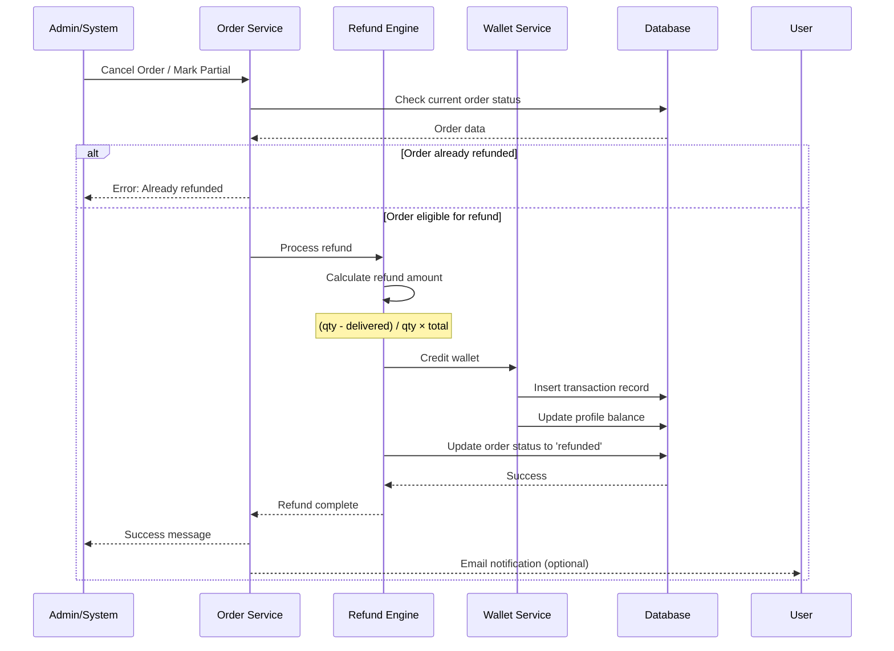
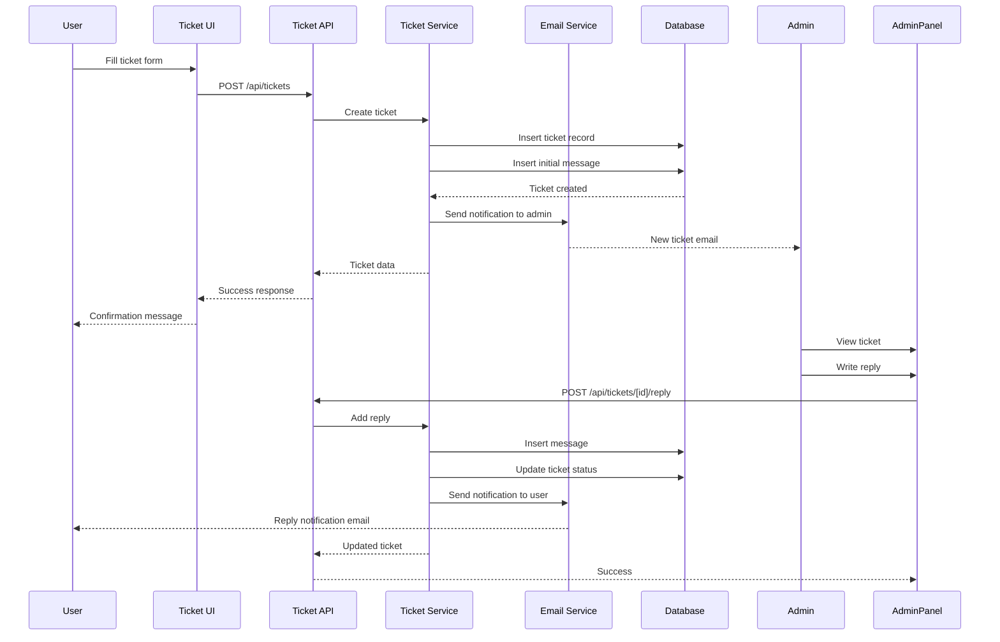

# Design Document: Automatic Refund & Ticket System

## Overview

This design implements two critical features for cheapfollower.shop: (1) an automatic refund system that calculates and processes refunds when orders are canceled or partially completed, crediting users' wallets with appropriate amounts, and (2) a functional support ticket system enabling users to create and track support requests with email notifications and admin management capabilities.

The refund system integrates with the existing order lifecycle, automatically detecting cancellations and partial completions, calculating refund amounts based on undelivered quantities, and preventing duplicate refunds through status tracking. The ticket system provides a complete support workflow with categorization, order attachment, status management, and bidirectional communication between users and administrators.

## Architecture

```mermaid
graph TB
    subgraph "User Interface Layer"
        UserDash[User Dashboard]
        TicketForm[Ticket Creation Form]
        TicketList[Ticket List View]
        OrderDetail[Order Detail Page]
    end
    
    subgraph "API Layer"
        RefundAPI[/api/orders/refund]
        TicketAPI[/api/tickets/*]
        OrderAPI[/api/orders/*]
    end
    
    subgraph "Business Logic Layer"
        RefundEngine[Refund Calculation Engine]
        TicketService[Ticket Service]
        OrderService[Order Service]
        WalletService[Wallet Service]
        NotificationService[Email Service]
    end
    
    subgraph "Data Layer"
        OrdersTable[(orders table)]
        TransactionsTable[(transactions table)]
        TicketsTable[(tickets table)]
        MessagesTable[(ticket_messages table)]
        ProfilesTable[(profiles table)]
    end
    
    subgraph "Admin Interface"
        AdminPanel[Admin Tickets Panel]
        AdminReply[Reply Interface]
    end
    
    OrderDetail -->|trigger refund| RefundAPI
    OrderService -->|status change| RefundEngine
    RefundEngine -->|calculate & credit| WalletService
    WalletService -->|record transaction| TransactionsTable
    RefundEngine -->|update status| OrdersTable
    
    TicketForm -->|create| TicketAPI
    TicketList -->|view/reply| TicketAPI
    TicketAPI -->|process| TicketService
    TicketService -->|send notification| NotificationService
    TicketService -->|persist| TicketsTable
    TicketService -->|persist messages| MessagesTable
    
    AdminPanel -->|manage| TicketAPI
    AdminReply -->|respond| TicketAPI
    
    RefundAPI -.->|read order data| OrdersTable
    TicketAPI -.->|read user data| ProfilesTable
```

## Main Algorithm/Workflow

### Refund Processing Flow



### Ticket Creation & Management Flow



## Core Interfaces/Types

### Refund System Types

```typescript
interface RefundCalculation {
  orderId: string;
  originalTotal: number;
  quantityOrdered: number;
  quantityDelivered: number;
  refundAmount: number;
  refundReason: 'canceled' | 'partial';
}

interface RefundResult {
  success: boolean;
  refundAmount: number;
  newWalletBalance: number;
  transactionId: string;
  error?: string;
}

interface RefundRequest {
  orderId: string;
  userId: string;
  reason: 'canceled' | 'partial';
  adminNote?: string;
}
```

### Ticket System Types

```typescript
interface Ticket {
  id: string;
  publicId: string;
  userId: string | null;
  category: TicketCategory;
  subject: string;
  status: TicketStatus;
  orderId?: string;
  createdAt: string;
  updatedAt: string;
}

interface TicketMessage {
  id: string;
  ticketId: string;
  authorRole: 'customer' | 'agent' | 'system';
  body: string;
  createdAt: string;
  attachments?: string[];
}

interface CreateTicketInput {
  userId?: string;
  guestEmail?: string;
  category: TicketCategory;
  subject: string;
  body: string;
  orderId?: string;
}

interface TicketReplyInput {
  ticketId: string;
  body: string;
  authorRole: 'customer' | 'agent';
  newStatus?: TicketStatus;
}

type TicketCategory = 'order' | 'payment' | 'refill' | 'account' | 'api' | 'service' | 'other';
type TicketStatus = 'open' | 'in_progress' | 'waiting_customer' | 'resolved' | 'closed';
```

## Key Functions with Formal Specifications

### Function 1: calculateRefundAmount()

```typescript
function calculateRefundAmount(
  order: Pick<PublicOrder, 'quantity' | 'delivered' | 'total' | 'status'>
): number
```

**Preconditions:**
- `order` is non-null and contains valid data
- `order.quantity` is a positive integer
- `order.delivered` is a non-negative integer ≤ `order.quantity`
- `order.total` is a positive number
- `order.status` is either 'canceled' or 'partial'

**Postconditions:**
- Returns a non-negative number representing the refund amount
- For canceled orders where `delivered === 0`: returns `order.total`
- For partial orders: returns `(quantity - delivered) / quantity × total`, rounded to 2 decimals
- Refund amount ≤ `order.total` (never exceeds original payment)
- Refund amount is precisely calculated to avoid floating-point errors

**Loop Invariants:** N/A (no loops in this function)

### Function 2: processRefund()

```typescript
async function processRefund(request: RefundRequest): Promise<RefundResult>
```

**Preconditions:**
- `request.orderId` is a valid order public ID
- `request.userId` matches the order's user ID (or admin override)
- Order exists in database and is paid
- Order status allows refund (not already 'refunded')
- User wallet exists or can be created

**Postconditions:**
- If successful: returns `{ success: true, refundAmount, newWalletBalance, transactionId }`
- Order status is updated to 'refunded' in database
- Wallet balance is increased by refund amount
- Transaction record is created with type='refund'
- If already refunded: returns `{ success: false, error: 'Already refunded' }`
- If error occurs: transaction is rolled back, no partial state changes
- Function is idempotent: calling twice with same order does not double-refund

**Loop Invariants:** N/A (async operations, no explicit loops)

### Function 3: createTicket()

```typescript
async function createTicket(input: CreateTicketInput): Promise<Ticket>
```

**Preconditions:**
- `input.subject` is non-empty string (trimmed length > 0)
- `input.body` is non-empty string (trimmed length > 0)
- `input.category` is valid TicketCategory value
- If `input.orderId` provided, order must exist
- Either `input.userId` or `input.guestEmail` must be provided

**Postconditions:**
- Returns newly created Ticket object with unique `id` and `publicId`
- Ticket is persisted to `tickets` table
- Initial message is persisted to `ticket_messages` table
- Ticket status is set to 'open'
- `createdAt` and `updatedAt` timestamps are set to current time
- Email notification is sent to support team
- If user is authenticated, `userId` is associated with ticket

**Loop Invariants:** N/A (single operation workflow)

### Function 4: replyToTicket()

```typescript
async function replyToTicket(input: TicketReplyInput): Promise<Ticket>
```

**Preconditions:**
- `input.ticketId` references an existing ticket
- `input.body` is non-empty string (trimmed length > 0)
- `input.authorRole` is either 'customer' or 'agent'
- If `authorRole === 'customer'`, caller must be ticket owner
- If `authorRole === 'agent'`, caller must have admin privileges

**Postconditions:**
- Returns updated Ticket object
- New message is appended to `ticket_messages` table
- Ticket's `updatedAt` timestamp is updated to current time
- If `input.newStatus` provided, ticket status is updated
- Email notification is sent to appropriate party:
  - If agent replies: notify customer
  - If customer replies: notify support team
- Message ordering is preserved (chronological by `createdAt`)

**Loop Invariants:** N/A (single message insertion)

## Algorithmic Pseudocode

### Main Refund Processing Algorithm

```pascal
ALGORITHM processRefund(request)
INPUT: request of type RefundRequest
OUTPUT: result of type RefundResult

BEGIN
  ASSERT request.orderId is not empty
  ASSERT request.userId is not empty
  
  // Step 1: Fetch and validate order
  order ← database.getOrder(request.orderId)
  
  IF order = null THEN
    RETURN { success: false, error: "Order not found" }
  END IF
  
  IF order.status = "refunded" THEN
    RETURN { success: false, error: "Already refunded" }
  END IF
  
  IF NOT order.paid THEN
    RETURN { success: false, error: "Order not paid" }
  END IF
  
  // Step 2: Calculate refund amount
  refundAmount ← calculateRefundAmount(order)
  
  IF refundAmount <= 0 THEN
    RETURN { success: false, error: "No refund due" }
  END IF
  
  // Step 3: Begin database transaction
  BEGIN TRANSACTION
    
    // Step 4: Credit wallet
    newBalance ← creditWallet(
      userId: request.userId,
      amount: refundAmount,
      method: "Refund",
      note: "Refund for order " + request.orderId
    )
    
    // Step 5: Update order status
    database.updateOrder(request.orderId, {
      status: "refunded",
      updatedAt: now()
    })
    
    // Step 6: Get transaction ID for response
    transaction ← database.getLatestTransaction(request.userId)
    
  COMMIT TRANSACTION
  
  // Step 7: Return success result
  RETURN {
    success: true,
    refundAmount: refundAmount,
    newWalletBalance: newBalance,
    transactionId: transaction.id
  }
  
EXCEPTION
  ROLLBACK TRANSACTION
  RETURN { success: false, error: exception.message }
END
```

**Preconditions:**
- Request contains valid order ID and user ID
- Database connection is available
- Wallet service is operational

**Postconditions:**
- Order status is 'refunded' if successful
- Wallet balance increased by refund amount
- Transaction record exists for refund
- All changes are atomic (all succeed or all fail)

**Loop Invariants:** N/A (sequential operations)

### Refund Amount Calculation Algorithm

```pascal
ALGORITHM calculateRefundAmount(order)
INPUT: order with fields (quantity, delivered, total, status)
OUTPUT: refundAmount of type number

BEGIN
  ASSERT order.quantity > 0
  ASSERT order.delivered >= 0
  ASSERT order.delivered <= order.quantity
  ASSERT order.total > 0
  
  // Step 1: Calculate undelivered quantity
  undelivered ← order.quantity - order.delivered
  
  // Step 2: Handle full cancellation
  IF order.status = "canceled" AND order.delivered = 0 THEN
    RETURN order.total
  END IF
  
  // Step 3: Handle partial delivery
  IF undelivered > 0 THEN
    // Calculate proportional refund
    refundRatio ← undelivered / order.quantity
    refundAmount ← order.total × refundRatio
    
    // Round to 2 decimal places (cents)
    refundAmount ← round(refundAmount, 2)
    
    RETURN refundAmount
  END IF
  
  // Step 4: No refund if fully delivered
  RETURN 0
END
```

**Preconditions:**
- Order quantities are valid positive/non-negative integers
- Total is positive number
- Delivered quantity does not exceed ordered quantity

**Postconditions:**
- Returns non-negative refund amount
- Refund never exceeds original total
- Precision is 2 decimal places (cents)

**Loop Invariants:** N/A (no loops)

### Ticket Creation Algorithm

```pascal
ALGORITHM createTicket(input)
INPUT: input of type CreateTicketInput
OUTPUT: ticket of type Ticket

BEGIN
  ASSERT input.subject.trim().length > 0
  ASSERT input.body.trim().length > 0
  ASSERT input.category IN validCategories
  ASSERT input.userId IS NOT null OR input.guestEmail IS NOT null
  
  // Step 1: Generate IDs
  ticketId ← generateUUID()
  publicId ← generatePublicId("TKT")
  messageId ← generateUUID()
  now ← getCurrentTimestamp()
  
  // Step 2: Validate order ID if provided
  IF input.orderId IS NOT null THEN
    order ← database.getOrder(input.orderId)
    IF order = null THEN
      THROW "Order not found"
    END IF
  END IF
  
  // Step 3: Begin database transaction
  BEGIN TRANSACTION
    
    // Step 4: Insert ticket record
    ticket ← database.insertTicket({
      id: ticketId,
      publicId: publicId,
      userId: input.userId,
      category: input.category,
      subject: input.subject.trim(),
      status: "open",
      orderId: input.orderId,
      createdAt: now,
      updatedAt: now
    })
    
    // Step 5: Insert initial message
    database.insertTicketMessage({
      id: messageId,
      ticketId: ticketId,
      authorRole: "customer",
      body: input.body.trim(),
      createdAt: now
    })
    
  COMMIT TRANSACTION
  
  // Step 6: Send email notification (async, don't block)
  emailService.notifyNewTicket({
    ticketId: publicId,
    category: input.category,
    subject: input.subject,
    recipientEmail: supportEmail
  })
  
  // Step 7: Return created ticket
  RETURN ticket
  
EXCEPTION
  ROLLBACK TRANSACTION
  THROW exception
END
```

**Preconditions:**
- Input has non-empty subject and body
- Category is valid enum value
- User identification provided (userId or guestEmail)
- Database is available

**Postconditions:**
- Ticket persisted with unique ID
- Initial message persisted
- Status is 'open'
- Email sent to support team
- All database operations are atomic

**Loop Invariants:** N/A (single transaction)

### Ticket Reply Algorithm

```pascal
ALGORITHM replyToTicket(input)
INPUT: input of type TicketReplyInput
OUTPUT: updatedTicket of type Ticket

BEGIN
  ASSERT input.ticketId IS NOT null
  ASSERT input.body.trim().length > 0
  ASSERT input.authorRole IN ["customer", "agent"]
  
  // Step 1: Fetch existing ticket
  ticket ← database.getTicket(input.ticketId)
  
  IF ticket = null THEN
    THROW "Ticket not found"
  END IF
  
  IF ticket.status = "closed" THEN
    THROW "Cannot reply to closed ticket"
  END IF
  
  // Step 2: Prepare message data
  messageId ← generateUUID()
  now ← getCurrentTimestamp()
  
  // Step 3: Determine new status
  newStatus ← input.newStatus
  IF newStatus = null THEN
    // Auto-transition based on reply
    IF input.authorRole = "agent" AND ticket.status = "open" THEN
      newStatus ← "in_progress"
    END IF
  END IF
  
  // Step 4: Begin database transaction
  BEGIN TRANSACTION
    
    // Step 5: Insert reply message
    database.insertTicketMessage({
      id: messageId,
      ticketId: input.ticketId,
      authorRole: input.authorRole,
      body: input.body.trim(),
      createdAt: now
    })
    
    // Step 6: Update ticket
    updatedTicket ← database.updateTicket(input.ticketId, {
      status: newStatus OR ticket.status,
      updatedAt: now
    })
    
  COMMIT TRANSACTION
  
  // Step 7: Send email notification
  IF input.authorRole = "agent" THEN
    // Notify customer
    IF ticket.userId IS NOT null THEN
      user ← database.getUser(ticket.userId)
      emailService.notifyTicketReply({
        recipientEmail: user.email,
        ticketId: ticket.publicId,
        subject: ticket.subject
      })
    END IF
  ELSE
    // Notify support team
    emailService.notifyTicketUpdate({
      recipientEmail: supportEmail,
      ticketId: ticket.publicId,
      subject: ticket.subject
    })
  END IF
  
  // Step 8: Return updated ticket
  RETURN updatedTicket
  
EXCEPTION
  ROLLBACK TRANSACTION
  THROW exception
END
```

**Preconditions:**
- Ticket exists in database
- Reply body is non-empty
- Author role is valid
- Ticket is not closed

**Postconditions:**
- Message appended to ticket
- Ticket updated timestamp refreshed
- Status updated if specified
- Appropriate email notification sent
- All operations are atomic

**Loop Invariants:** N/A (single transaction)

## Example Usage

### Refund System Usage

```typescript
// Example 1: Process automatic refund when order is canceled
const cancelResult = await cancelOrder("CF789012");
// Internally triggers refund if order was paid

// Example 2: Manual refund processing (admin action)
const refundRequest: RefundRequest = {
  orderId: "CF789012",
  userId: "user-uuid-here",
  reason: "canceled",
  adminNote: "User requested cancellation"
};

const refundResult = await processRefund(refundRequest);
if (refundResult.success) {
  console.log(`Refunded $${refundResult.refundAmount}`);
  console.log(`New balance: $${refundResult.newWalletBalance}`);
}

// Example 3: Calculate refund for partial order
const order = await getOrder("CF123456");
// order.quantity = 1000, order.delivered = 750, order.total = 50.00

const refundAmount = calculateRefundAmount(order);
// refundAmount = (1000 - 750) / 1000 * 50.00 = 12.50

// Example 4: Prevent double refund
const firstRefund = await processRefund(refundRequest);
// firstRefund.success = true

const secondRefund = await processRefund(refundRequest);
// secondRefund.success = false
// secondRefund.error = "Already refunded"
```

### Ticket System Usage

```typescript
// Example 1: User creates a ticket
const ticketInput: CreateTicketInput = {
  userId: "user-uuid-here",
  category: "order",
  subject: "Missing followers from order CF123456",
  body: "I ordered 1000 followers but only received 750. Can you help?",
  orderId: "CF123456"
};

const ticket = await createTicket(ticketInput);
console.log(`Ticket created: ${ticket.publicId}`);
// Email sent to support@cheapfollower.shop

// Example 2: Admin replies to ticket
const replyInput: TicketReplyInput = {
  ticketId: ticket.id,
  body: "Thank you for reaching out. I've initiated a refill for your order. You should see the remaining followers delivered within 24 hours.",
  authorRole: "agent",
  newStatus: "in_progress"
};

const updatedTicket = await replyToTicket(replyInput);
// Email sent to user

// Example 3: List user's tickets
const userTickets = await listTicketsForUser("user-uuid-here");
userTickets.forEach(ticket => {
  console.log(`${ticket.publicId}: ${ticket.subject} [${ticket.status}]`);
});

// Example 4: Guest creates ticket (no account)
const guestTicket: CreateTicketInput = {
  guestEmail: "guest@example.com",
  category: "payment",
  subject: "Payment not processing",
  body: "I tried to add funds but the payment keeps failing."
};

const ticket2 = await createTicket(guestTicket);
// Ticket created without userId, tracked by email
```

## Correctness Properties

### Refund System Properties

**Property 1: Refund Idempotency**
```typescript
∀ order: Order, ∀ n ≥ 1: processRefund(order) called n times 
  ⟹ exactly 1 refund transaction created
```
*Verification*: Check that order status transitions to 'refunded' only once, preventing duplicate refunds.

**Property 2: Refund Amount Accuracy**
```typescript
∀ order: Order where order.status ∈ {canceled, partial}:
  calculateRefundAmount(order) = 
    (order.quantity - order.delivered) / order.quantity × order.total
  ∧ 0 ≤ refundAmount ≤ order.total
```
*Verification*: Unit test with various quantity/delivered combinations; verify rounding to 2 decimals.

**Property 3: Wallet Balance Integrity**
```typescript
∀ refund: RefundResult where refund.success = true:
  user.walletBalance_after = user.walletBalance_before + refund.refundAmount
```
*Verification*: Query wallet balance before and after refund; verify exact increment.

**Property 4: Transaction Record Creation**
```typescript
∀ successful refund:
  ∃ transaction ∈ WalletTxn where
    transaction.type = "refund" ∧
    transaction.amount = refundAmount ∧
    transaction.userId = order.userId
```
*Verification*: Query transactions table after refund; verify record exists with correct fields.

**Property 5: Full Cancellation Refund**
```typescript
∀ order: Order where order.status = "canceled" ∧ order.delivered = 0:
  calculateRefundAmount(order) = order.total
```
*Verification*: Test canceled orders with zero delivery; verify full refund.

### Ticket System Properties

**Property 6: Ticket Creation Atomicity**
```typescript
∀ input: CreateTicketInput:
  createTicket(input) succeeds ⟹
    (∃ ticket ∈ Tickets ∧ ∃ message ∈ TicketMessages)
  ∨ createTicket(input) fails ⟹
    (¬∃ ticket ∧ ¬∃ message)
```
*Verification*: Simulate database failures during ticket creation; verify no orphaned records.

**Property 7: Message Chronological Ordering**
```typescript
∀ ticket: Ticket, ∀ m1, m2 ∈ ticket.messages:
  m1.createdAt < m2.createdAt ⟹ m1 appears before m2 in message list
```
*Verification*: Create multiple messages rapidly; query and verify ordering by timestamp.

**Property 8: Status Transition Validity**
```typescript
∀ ticket: Ticket:
  ticket.status transitions follow valid path:
    open → in_progress → {waiting_customer, resolved, closed}
  ∧ closed is terminal state (no further transitions)
```
*Verification*: Test state machine transitions; verify closed tickets cannot be updated.

**Property 9: Email Notification Delivery**
```typescript
∀ ticket creation or reply:
  operation succeeds ⟹ email notification sent to appropriate recipient
    (customer ⟹ notify support)
    (agent ⟹ notify customer)
```
*Verification*: Mock email service; verify notification calls with correct recipients.

**Property 10: Order Association**
```typescript
∀ ticket: Ticket where ticket.orderId ≠ null:
  ∃ order ∈ Orders where order.publicId = ticket.orderId
```
*Verification*: Test ticket creation with invalid order ID; verify rejection.

## Error Handling

### Refund System Errors

#### Error Scenario 1: Order Not Found

**Condition**: Order ID does not exist in database

**Response**: Return `{ success: false, error: "Order not found" }` with HTTP 404

**Recovery**: User should verify order ID; admin can check if order was deleted

#### Error Scenario 2: Already Refunded

**Condition**: Order status is already 'refunded'

**Response**: Return `{ success: false, error: "Order already refunded" }` with HTTP 400

**Recovery**: No action needed; inform user refund was previously processed

#### Error Scenario 3: Order Not Paid

**Condition**: Order status is 'pending' or `paid` flag is false

**Response**: Return `{ success: false, error: "Cannot refund unpaid order" }` with HTTP 400

**Recovery**: User must complete payment first; admin can cancel without refund

#### Error Scenario 4: Insufficient Data for Calculation

**Condition**: Order missing quantity, delivered, or total fields

**Response**: Return `{ success: false, error: "Invalid order data" }` with HTTP 500

**Recovery**: Admin must investigate data integrity issue; may require manual correction

#### Error Scenario 5: Database Transaction Failure

**Condition**: Database error during refund processing (network, constraint violation)

**Response**: Rollback all changes; return `{ success: false, error: "Refund failed, please retry" }` with HTTP 500

**Recovery**: Retry operation; if persists, escalate to technical team

### Ticket System Errors

#### Error Scenario 6: Empty Subject or Body

**Condition**: Ticket submitted with blank subject or message body

**Response**: Return HTTP 400 with error: "Subject and message body are required"

**Recovery**: User must provide valid content; show validation error in UI

#### Error Scenario 7: Invalid Order ID Reference

**Condition**: Ticket references non-existent order ID

**Response**: Return HTTP 400 with error: "Order not found. Please verify the order ID."

**Recovery**: User should correct order ID or submit ticket without order reference

#### Error Scenario 8: Reply to Closed Ticket

**Condition**: Attempting to add message to ticket with status='closed'

**Response**: Return HTTP 400 with error: "Cannot reply to closed ticket"

**Recovery**: User can request ticket reopening; admin can manually reopen if needed

#### Error Scenario 9: Unauthorized Access

**Condition**: User trying to access or reply to another user's ticket

**Response**: Return HTTP 403 with error: "Unauthorized"

**Recovery**: User can only access their own tickets; admin has full access

#### Error Scenario 10: Email Service Failure

**Condition**: Email notification fails to send (service down, invalid recipient)

**Response**: Log error but don't block ticket operation; ticket/reply still succeeds

**Recovery**: Retry email sending via background job; admin can manually notify if critical

## Testing Strategy

### Unit Testing Approach

**Refund Calculation Tests**:
- Test full cancellation refund (delivered=0)
- Test partial delivery refund (various ratios)
- Test fully delivered order (refund=0)
- Test rounding precision (avoid floating point errors)
- Test edge cases (quantity=1, very large quantities)

**Refund Processing Tests**:
- Mock database and wallet service
- Test successful refund flow
- Test duplicate refund prevention
- Test order not found
- Test unpaid order rejection
- Test transaction rollback on failure

**Ticket Creation Tests**:
- Test valid ticket creation
- Test empty subject/body rejection
- Test order association validation
- Test guest vs. authenticated user tickets
- Test public ID generation uniqueness

**Ticket Reply Tests**:
- Test agent reply
- Test customer reply
- Test status transitions
- Test closed ticket rejection
- Test message ordering

### Property-Based Testing Approach

**Property Test Library**: fast-check (for TypeScript/Node.js)

**Property 1: Refund amount never exceeds order total**
```typescript
fc.assert(
  fc.property(
    fc.integer({ min: 1, max: 100000 }), // quantity
    fc.integer({ min: 0, max: 100000 }), // delivered
    fc.float({ min: 0.01, max: 10000, noNaN: true }), // total
    (quantity, delivered, total) => {
      fc.pre(delivered <= quantity); // precondition
      const order = { quantity, delivered, total, status: 'partial' };
      const refund = calculateRefundAmount(order);
      return refund >= 0 && refund <= total;
    }
  )
);
```

**Property 2: Refund calculation is deterministic**
```typescript
fc.assert(
  fc.property(
    fc.record({
      quantity: fc.integer({ min: 1, max: 100000 }),
      delivered: fc.integer({ min: 0, max: 100000 }),
      total: fc.float({ min: 0.01, max: 10000 }),
      status: fc.constantFrom('canceled', 'partial')
    }),
    (order) => {
      fc.pre(order.delivered <= order.quantity);
      const refund1 = calculateRefundAmount(order);
      const refund2 = calculateRefundAmount(order);
      return refund1 === refund2; // same input = same output
    }
  )
);
```

**Property 3: Ticket messages maintain chronological order**
```typescript
fc.assert(
  fc.property(
    fc.array(fc.record({
      body: fc.string({ minLength: 1, maxLength: 500 }),
      authorRole: fc.constantFrom('customer', 'agent')
    }), { minLength: 1, maxLength: 20 }),
    async (messages) => {
      const ticket = await createTicket({
        userId: 'test-user',
        category: 'other',
        subject: 'Test',
        body: messages[0].body
      });
      
      for (let i = 1; i < messages.length; i++) {
        await replyToTicket({
          ticketId: ticket.id,
          body: messages[i].body,
          authorRole: messages[i].authorRole
        });
      }
      
      const loadedTicket = await getTicket(ticket.id);
      const timestamps = loadedTicket.messages.map(m => new Date(m.createdAt).getTime());
      
      // Verify strictly increasing timestamps
      for (let i = 1; i < timestamps.length; i++) {
        if (timestamps[i] <= timestamps[i-1]) return false;
      }
      return true;
    }
  )
);
```

**Property 4: Status transitions are monotonic**
```typescript
const statusOrder = ['open', 'in_progress', 'waiting_customer', 'resolved', 'closed'];

fc.assert(
  fc.property(
    fc.array(fc.constantFrom(...statusOrder), { minLength: 2, maxLength: 5 }),
    async (statuses) => {
      const ticket = await createTicket({
        userId: 'test-user',
        category: 'other',
        subject: 'Test',
        body: 'Test body'
      });
      
      let prevIndex = 0;
      for (const status of statuses) {
        const currentIndex = statusOrder.indexOf(status);
        // Allow equal or forward transitions only
        if (currentIndex < prevIndex) return true; // skip invalid test case
        
        await replyToTicket({
          ticketId: ticket.id,
          body: 'Status update',
          authorRole: 'agent',
          newStatus: status
        });
        
        prevIndex = currentIndex;
      }
      
      return true; // all transitions were valid
    }
  )
);
```

### Integration Testing Approach

**Refund Integration Tests**:
- Test complete flow: create order → pay → cancel → verify refund → verify wallet balance
- Test partial delivery scenario: create order → mark partial → verify proportional refund
- Test concurrent refund attempts (race condition)
- Test refund with Supabase database (not mocked)

**Ticket Integration Tests**:
- Test complete flow: create ticket → admin reply → customer reply → resolve
- Test ticket with order association
- Test email notification integration (using test email service)
- Test pagination for ticket lists (many tickets)
- Test real-time ticket updates (WebSocket/polling)

**End-to-End Tests** (using Playwright or Cypress):
- User journey: Cancel order and see refund in wallet
- User journey: Create ticket, receive email, see reply
- Admin journey: View tickets, reply, change status
- Guest journey: Create ticket without login, track by ID

## Performance Considerations

**Refund Processing**:
- Refund calculations are O(1) - simple arithmetic operations
- Database queries use indexed columns (order.public_id, user.id)
- Transaction processing should complete in <100ms typically
- Consider batching refunds for bulk cancellations (admin tool)

**Ticket System**:
- Ticket list queries use pagination (LIMIT/OFFSET) to avoid loading all tickets
- Message queries filtered by ticket_id with index for fast retrieval
- Email notifications sent asynchronously (don't block API response)
- Consider caching frequently accessed tickets (Redis) if volume is high

**Database Indexing**:
```sql
-- Ensure these indexes exist for optimal performance
CREATE INDEX idx_orders_public_id ON orders(public_id);
CREATE INDEX idx_orders_status ON orders(status);
CREATE INDEX idx_orders_user_id ON orders(user_id);
CREATE INDEX idx_tickets_user_id ON tickets(user_id);
CREATE INDEX idx_tickets_status ON tickets(status);
CREATE INDEX idx_ticket_messages_ticket_id ON ticket_messages(ticket_id);
CREATE INDEX idx_transactions_user_id ON transactions(user_id);
```

**Scaling Considerations**:
- Refund operations are transactional and serialized per order (no parallelization needed)
- Ticket creation can handle concurrent requests (UUID prevents collisions)
- Email sending should use queue system (e.g., Bull with Redis) for high volume
- Consider read replicas for ticket list queries if read-heavy

## Security Considerations

**Refund System Security**:
- **Authorization**: Only order owner or admin can request refund
- **Audit Trail**: Log all refund operations with actor, timestamp, and reason
- **Idempotency**: Use order status to prevent double refunds (no double-spend)
- **Amount Validation**: Server-side calculation only (never trust client input)
- **Rate Limiting**: Prevent refund request spam (max 5 per minute per user)

**Ticket System Security**:
- **Data Isolation**: RLS policies ensure users only see their own tickets
- **Input Sanitization**: Escape HTML/script tags in ticket body to prevent XSS
- **Attachment Validation**: If file attachments added later, validate file type/size
- **Email Injection Prevention**: Sanitize email headers to prevent injection attacks
- **Guest Ticket Tracking**: Use secure token (UUID) for guest ticket access, not sequential IDs

**Database Security**:
```sql
-- Row-Level Security policies
CREATE POLICY "users_own_tickets" ON tickets
  FOR SELECT USING (auth.uid() = user_id);

CREATE POLICY "admins_all_tickets" ON tickets
  FOR ALL USING (
    EXISTS (
      SELECT 1 FROM profiles 
      WHERE id = auth.uid() AND role = 'admin'
    )
  );

-- Similar policies for ticket_messages, transactions
```

**API Security**:
- Authenticate all refund and ticket endpoints
- Use CSRF tokens for state-changing operations
- Validate JWT tokens on every request
- Return generic error messages (don't leak system details)

## Dependencies

**Existing Dependencies** (already in project):
- `@supabase/supabase-js` - Database operations and authentication
- `next` - API routes and server-side rendering
- `react` - UI components
- TypeScript - Type safety

**New Dependencies Required**:
- `nodemailer` or `@sendgrid/mail` - Email notifications
  - Recommended: `nodemailer` for development (SMTP), `@sendgrid/mail` for production
- `date-fns` or `dayjs` - Date/time formatting for tickets
  - Recommended: `date-fns` (tree-shakeable, smaller bundle)

**Email Service Setup**:
```typescript
// lib/email.ts (new file)
import nodemailer from 'nodemailer';

const transporter = nodemailer.createTransport({
  host: process.env.SMTP_HOST,
  port: Number(process.env.SMTP_PORT),
  auth: {
    user: process.env.SMTP_USER,
    pass: process.env.SMTP_PASS,
  },
});

export async function sendEmail(to: string, subject: string, html: string) {
  await transporter.sendMail({
    from: process.env.SUPPORT_EMAIL,
    to,
    subject,
    html,
  });
}
```

**Environment Variables** (add to `.env`):
```bash
# Email service
SMTP_HOST=smtp.gmail.com
SMTP_PORT=587
SMTP_USER=support@cheapfollower.shop
SMTP_PASS=your-app-password
SUPPORT_EMAIL=support@cheapfollower.shop

# Feature flags (optional)
ENABLE_AUTO_REFUNDS=true
ENABLE_TICKET_EMAILS=true
```

**Database Migrations Required**:
- Add `paid` column to `orders` table (boolean, default false) - already exists in schema
- Add `promo_code` column to `orders` table (text, nullable) - already exists in schema
- Ensure `tickets` and `ticket_messages` tables exist with correct schema
- Add indexes for performance (see Performance Considerations section)

**No Breaking Changes**:
- Refund system extends existing order/wallet functionality
- Ticket system uses existing Supabase tables (already in schema)
- All changes are additive (backward compatible)
